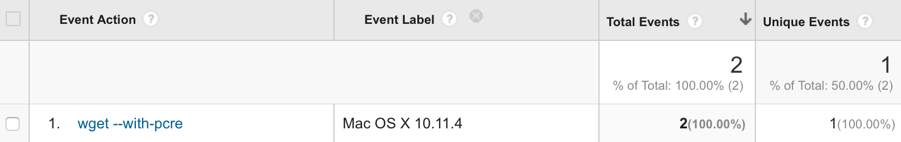

# Anonymous Aggregate User Behaviour Analytics

Homebrew has begun gathering anonymous aggregate user behaviour analytics and reporting these to Google Analytics. You will be notified the first time you run `brew update` or install Homebrew.

## Why?
Homebrew is provided free of charge and run entirely by volunteers in their spare time. As a result, we do not have the resources to do detailed user studies of Homebrew users to decide on how best to design future features and prioritise current work. Anonymous aggregate user analytics allow us to prioritise fixes and features based on how, where and when people use Homebrew. For example:

- If a formula is widely used and is failing often it will enable us to prioritise fixing that formula over others.
- Collecting the OS version allows us to decide what versions of macOS to prioritise and support and identify build failures that occur only on single versions.

## What?
Homebrew's analytics record some shared information for every event:

- The Homebrew user agent, e.g. `Homebrew/0.9.9 (Macintosh; Intel macOS 10.12.0) curl/7.43.0`
- The Google Analytics version, i.e. `1` (https://developers.google.com/analytics/devguides/collection/protocol/v1/parameters#v)
- The Homebrew analytics tracking ID, e.g. `UA-75654628-1` (https://developers.google.com/analytics/devguides/collection/protocol/v1/parameters#tid)
- A Homebrew analytics user ID, e.g. `1BAB65CC-FE7F-4D8C-AB45-B7DB5A6BA9CB`. This is generated by `uuidgen` and stored in the repository-specific Git configuration variable `homebrew.analyticsuuid` within `$(brew --repository)/.git/config`. This does not allow us to track individual users but does enable us to accurately measure user counts vs. event counts (https://developers.google.com/analytics/devguides/collection/protocol/v1/parameters#cid)
- If the Google Analytics anonymous IP setting is enabled, i.e. `1` (https://developers.google.com/analytics/devguides/collection/protocol/v1/parameters#aip)
- The Homebrew application name, e.g. `Homebrew` (https://developers.google.com/analytics/devguides/collection/protocol/v1/parameters#an)
- The Homebrew application version, e.g. `0.9.9` (https://developers.google.com/analytics/devguides/collection/protocol/v1/parameters#av)
- The Homebrew analytics hit type, e.g. `event` (https://developers.google.com/analytics/devguides/collection/protocol/v1/parameters#t)

Homebrew's analytics records the following different events:

- an `event` hit type with the `install` event category and the Homebrew formula from a non-private GitHub tap you have requested to install plus any used options, e.g. `wget --with-pcre` as the action and an event label e.g. `macOS 10.12, non-/usr/local, CI` to indicate the OS version, non-standard installation location and invocation as part of CI. This allows us to identify the formulae that need fixing and where more easily.
- an `event` hit type with the `BuildError` event category and the Homebrew formula that failed to install, e.g. `wget` as the action and an event label e.g. `macOS 10.12`

You can also view all the information that is sent by Homebrew's analytics by setting `HOMEBREW_ANALYTICS_DEBUG=1` in your environment. Please note this will also stop any analytics from being sent.

It is impossible for the Homebrew developers to match any particular event to any particular user, even if we had access to the Homebrew analytics user ID (which we do not). An example of the most user-specific information we can see from Google Analytics:



As far as we can tell it would be impossible for Google to match the randomly generated Homebrew-only analytics user ID to any other Google Analytics user ID. If Google turned evil the only thing they could do would be to lie about anonymising IP addresses and attempt to match users based on IP addresses.

## When/Where?
Homebrew's analytics are sent throughout Homebrew's execution to Google Analytics over HTTPS.

## Who?
Homebrew's detailed analytics are accessible to Homebrew's current maintainers. Contact @MikeMcQuaid if you are a maintainer and need access.

Summaries of installation and error analytics are publicly available [here](https://brew.sh/analytics/).

## How?
The code is viewable in [analytics.rb](https://github.com/Homebrew/brew/blob/master/Library/Homebrew/utils/analytics.rb) and [analytics.sh](https://github.com/Homebrew/brew/blob/master/Library/Homebrew/utils/analytics.sh). They are done in a separate background process and fail fast to avoid delaying any execution. They will fail immediately and silently if you have no network connection.

## Opting out
Homebrew analytics helps us maintainers and leaving it on is appreciated. However, if you want to opt out of Homebrew's analytics, you can set this variable in your environment:

```sh
export HOMEBREW_NO_ANALYTICS=1
```

Alternatively, this will prevent analytics from ever being sent:

```sh
brew analytics off
```
