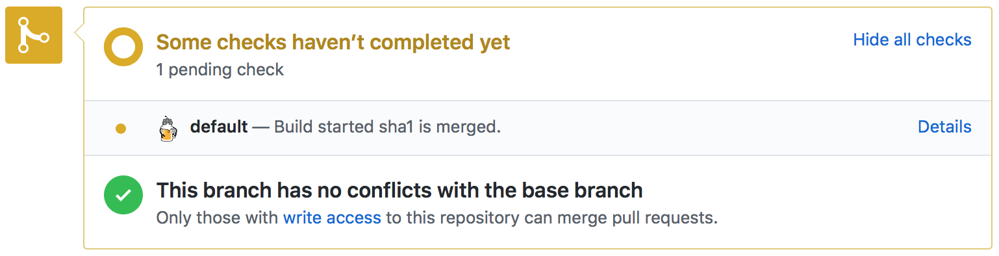
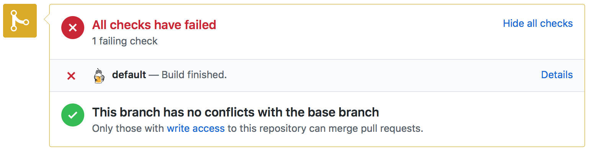
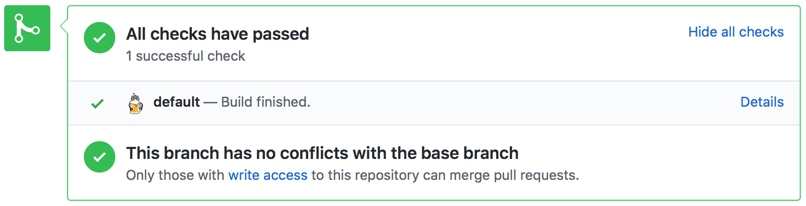
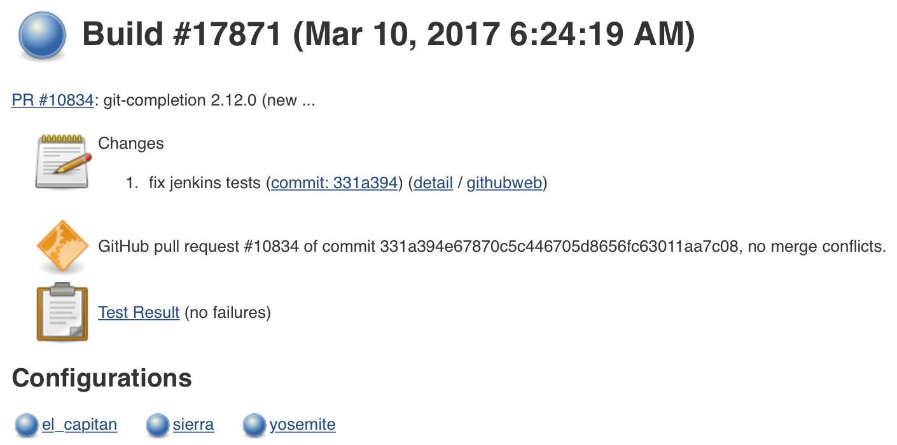
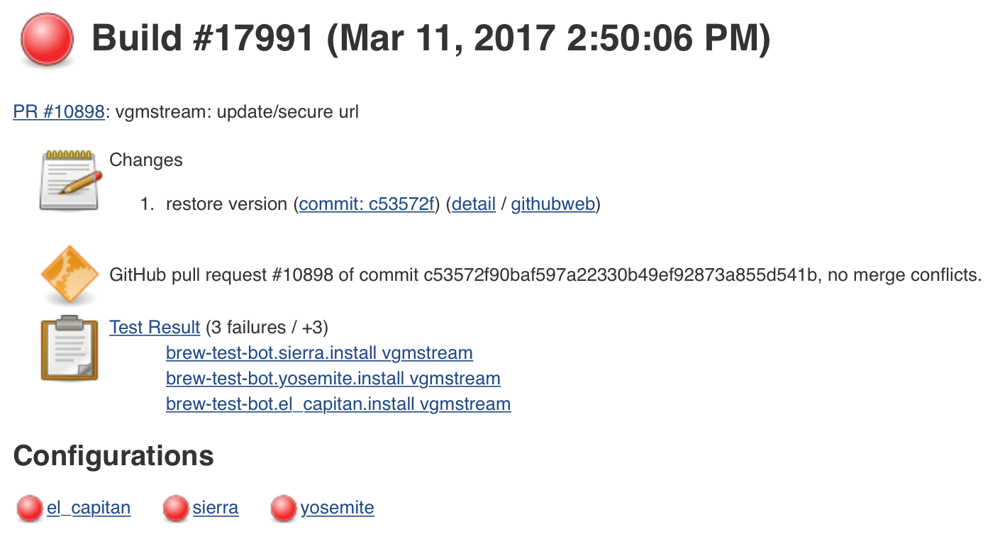
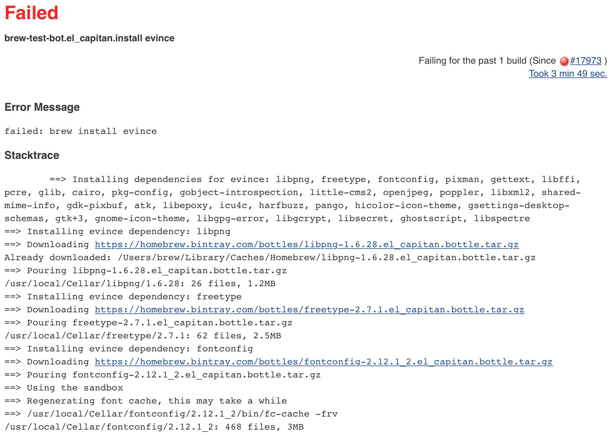

# Brew Test Bot

`brew test-bot` is the name for the automated review and testing system funded
by [our Kickstarter in 2013](https://www.kickstarter.com/projects/homebrew/brew-test-bot).

It comprises four Mac Minis running in a data centre in England which host
[a Jenkins instance at https://jenkins.brew.sh](https://jenkins.brew.sh) and run the
[`brew-test-bot.rb`](https://github.com/Homebrew/homebrew-test-bot/blob/master/cmd/brew-test-bot.rb)
Ruby script to perform automated testing of commits to the master branch, pull
requests and custom builds requested by maintainers.

## Pull Requests

The bot automatically builds pull requests and updates their status depending
on the result of the job.

For example, a job which has been queued but not yet completed will have a
section in the pull request that looks like this:

---

A failed build looks like this:

---

A passed build looks like this:

---

On failed or passed builds you can click the "Details" link to view the result
in Jenkins.

When you click this you'll see the results.

A passed build looks like this:

---

A failed build looks like this:

---

You can click the test results link
(e.g. `brew-test-bot.el_capitan.install openssl`) to
view the failed test output:

---
